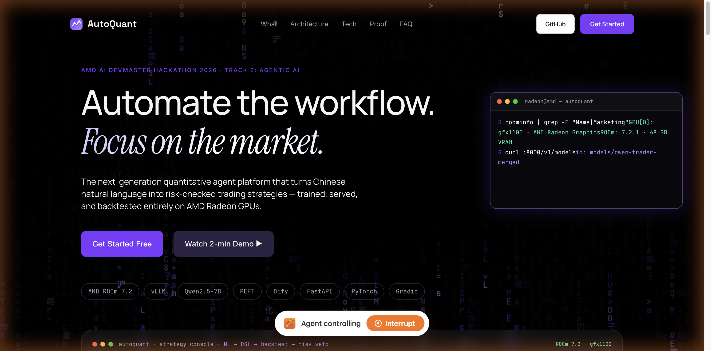
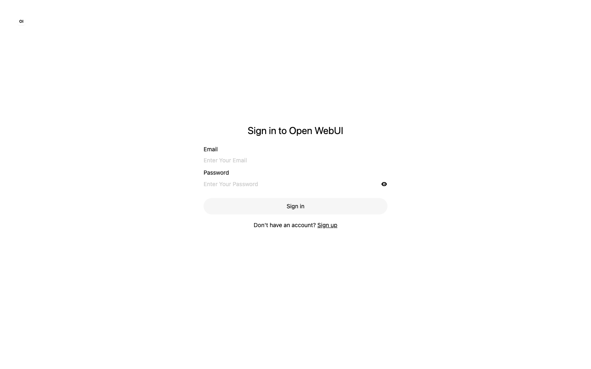
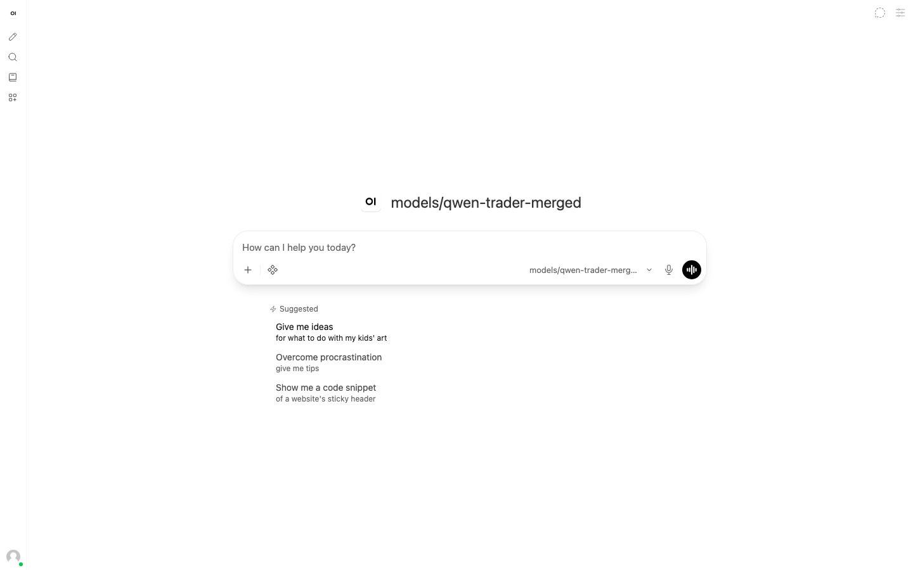
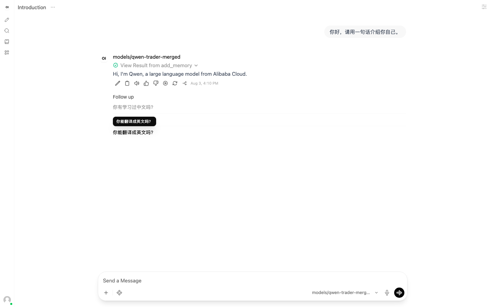
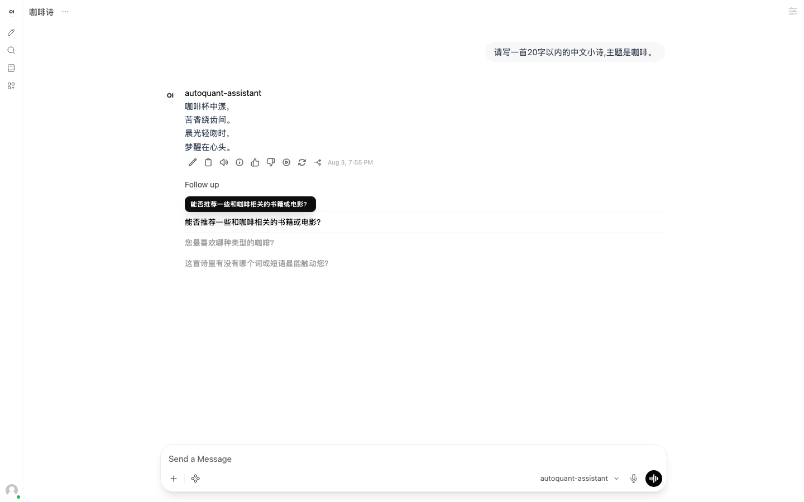
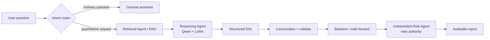
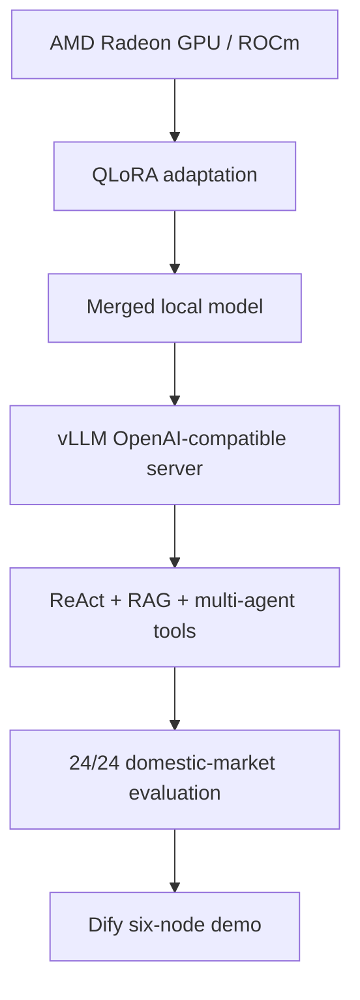

# Radeon-hackathon-2026-07

## how to apply and use AMD Radeon GPU
see [README](https://github.com/AMD-DEV-CONTEST/Radeon-hackathon-2026-07/blob/main/Radeon-Cloud-User%20Guide/README.md)

## Track 3 starter demo: robot simulation on AMD Radeon GPU

New to robotics, or want to learn how to run robot simulation on AMD GPUs? This reference demo is a quick, hands-on starting point for Track 3 participants — an end-to-end pipeline where a Franka Panda arm picks fruit off a table and places it in a bowl, built on the **Genesis** physics engine and **LeRobot**, running on an AMD Radeon (ROCm) GPU.

▶️ **Demo repo & videos:** https://github.com/wangxunx/franka_fruit_pick_demo

What you'll learn:
- Set up a robot simulation environment on an AMD Radeon GPU (ROCm), using the prebuilt ROCm PyTorch wheels
- Build a scene and run physics simulation with **Genesis**
- Record data, apply domain randomization, and train a visuomotor policy with **LeRobot**
- Go end-to-end — from a scripted pick-and-place to a trained, closed-loop policy, with evaluation videos

> Note: this is a learning reference to show how to run simulation and training on an AMD GPU with `genesis-world` + `lerobot`; the trained model's success rate is not guaranteed.

## when you submit
**pls fork this repo and open a pull request including the stuff that is mentioned in Rules&conditions of luma page. the title of pull request should be like "Track x, Team name, your application name"**

> [!IMPORTANT]
> Team name was an optional field on the Luma registration form. If you did not fill in a team name when you registered, please use your own name instead, so the title of the pull request should be like **"Track x, Your name, your application name"**.

> [!NOTE]
> All submission materials, project descriptions, and Pull Requests should be submitted in English.

## Submission Requirements

### Track 1: Development of Multimodal Content Creation Tools

1. **Project Profile Document (PDF)**
   - Project background
   - Target users & application scenarios
   - System architecture
   - Model & algorithm introduction
   - Adaptation description for AMD Radeon GPU / ROCm
2. **Project Source Code**
   - Complete source code repository
   - README file including environment configuration, startup guide and dependency list
3. **Demo Video**
   - Recommended duration: 3–5 minutes
   - Demonstrate the actual operation process
   - The actual execution performance on an AMD Radeon GPU, from command line/GUI to the final result (clarity, stability and diversity of outputs)
4. **Supplementary Materials (Choose One)**
   - PPT / Poster (highlight creative scenarios, practical value of the tool)

### Track 2: Development & Local Deployment of Private AI Agents

1. **Project Specification Document**
   - Application scenarios
   - Agent architecture diagram
   - Introduction to core capabilities
   - Model introduction & local deployment plan
   - Optimization description for inference speed on AMD Radeon GPU
2. **Project Source Code**
   - Complete source code repository
   - README file including environment configuration, startup guide and dependency list
3. **Demo Video**
   - Recommended duration: 3–5 minutes
   - Demonstrate the actual operation process
   - The actual execution performance on an AMD Radeon GPU, from command line/GUI to the final result (fluidity and functional completeness)
4. **Supplementary Materials (Choose One)**
   - PPT / Poster

### Track 3: Physical AI Challenge – Robotics Simulation and Application Design based on AMD Radeon GPUs and ROCm

1. **Technical Report** (should include, but is not limited to):
   - Definition and description of the target application
   - Overall system architecture and solution design
   - Description of the datasets used for training and/or evaluation
   - Explanation of how AMD Radeon GPUs are utilized during training, inference, and other relevant stages
   - Description of the innovations, key technical contributions, and important aspects of the project
   - Description of the final deliverables and output forms of the project
   - Any additional information that participants believe highlights the strengths or unique aspects of their work
   - Introduction of team members and their respective contributions
2. **Project Source Code**
   - Dedicated source code repositories
   - A Docker image containing the complete source code and all required components for running the project would be preferable
3. **Reproducibility Instruction README** — a detailed README document containing:
   - Environment setup instructions
   - Execution and usage instructions
   - Dependency specifications
   - Step-by-step reproduction procedures
   - Following the provided instructions should allow evaluators to reproduce the submitted results
4. **Demonstration Video** (Recommended Length 3~5 minutes)
   - The video should demonstrate the complete workflow of the project, including command-line and/or GUI operations, execution procedures, and results
5. **Supplementary materials** in other formats may be submitted to demonstrate the value of the proposed technical solution.

---

# Radeon Hackathon 2026 — Track 2

## AMD ROCm Local Quantitative Investment Assistant

[](https://www.amd.com/en/products/software/rocm.html)
[](https://huggingface.co/Qwen/Qwen2.5-7B-Instruct)
[](https://docs.vllm.ai/)
[](./docs/track2_final_status.md)

**AMD AI DevMaster Hackathon 2026 — Track 2: Development & Local Deployment of Private AI Agents**

This repository is the **Track 2 submission**. It is an auditable, locally deployed investment and quantitative assistant for the domestic securities market. Inference and LoRA fine-tuning run on an AMD Radeon GPU with ROCm.

The assistant answers ordinary questions, retrieves knowledge, generates a constrained strategy DSL, validates it, runs a deterministic backtest, and returns a risk-aware report. It does not place real orders.

This is not a live trading system. Demo backtests use deterministic synthetic historical data unless a public data adapter is explicitly enabled.

## Live demo

Try the running system — inference on an AMD Radeon GPU (ROCm 7.2.1), local Qwen2.5-7B + LoRA served by vLLM:

- **Showcase site**: [AutoQuant landing](https://61a41b94d2884d3c8a0e5cdea2f8f218.bj6.agentos-app.net)
- **Chat interface**: [Open WebUI](https://minimize-orders-excel-saving.trycloudflare.com) — register or sign in, then chat with model `autoquant-assistant` (one unified entry, auto-routed: **quantitative questions → local strategy model**, **general questions → personal assistant**)
- **Personal-assistant mode**: ask anything — travel plans, writing, Q&A, daily life — it answers directly like an assistant; quantitative requests are automatically routed into the local strategy DSL pipeline



| Sign in / register | Chat with the local model |
|---|---|
|  |  |





**Demo video** (4 min 23 s, English narration, real run on an AMD Radeon GPU):

<video src="output/video/track2_demo_1080p_ava.mp4" controls></video>

**Submission deck & poster:**

- **Deck** (11 pages, PDF): [`output/pdf/track2_submission_ppt.pdf`](./output/pdf/track2_submission_ppt.pdf)
- **Poster**:


## Track 2 submission alignment (official requirements)

This repository is the complete **Track 2 — Development & Local Deployment of Private AI Agents** submission. It satisfies every item in the official checklist (all materials in English):

| # | Official requirement | Where it lives in this repo |
|---|---|---|
| 1 | **Project Specification Document** — application scenarios, agent architecture diagram, core capabilities, model introduction & local-deployment plan, AMD ROCm inference-speed optimization | [`output/pdf/AMD_Quant_Assistant_Project_Specification.pdf`](./output/pdf/AMD_Quant_Assistant_Project_Specification.pdf); architecture diagram and AMD optimization also in this README (`## Architecture`, `## Why AMD is part of the solution`) |
| 2 | **Project Source Code + README** — full repo with environment config, startup guide, and dependency list | entire repository; this README (`## One-command reproducible demo (no GPU required)

The fastest way to see the full pipeline running — **no AMD GPU, no model weights, no network, no real funds**:

```bash
pip install -r requirements.txt
python demos/run_track2_demo.py
```

It runs the complete pipeline in-process on **deterministic synthetic OHLCV data**:
natural language → strategy DSL → canonicalization → schema validation → Freqtrade/Backtrader transpilation → 180-day backtest → independent risk report (APPROVE / MODIFY / REJECT).
Every run is reproducible (seeded data), and the risk agent's veto semantics are demonstrated live.

On an AMD ROCm machine with the local vLLM model running, the same script automatically uses the real model for DSL generation instead of the built-in templates:

```bash
VLLM=http://127.0.0.1:8000/v1 MODEL=models/qwen-trader-merged python demos/run_track2_demo.py
```

## Reproduce on an AMD ROCm machine`, `## Repository layout`) |
| 3 | **Demo Video** — 3–5 min, real run on AMD Radeon GPU from CLI/GUI to final result | [`output/video/track2_demo_1080p_ava.mp4`](./output/video/track2_demo_1080p_ava.mp4) — 4 min 23 s, English narration (Microsoft Ava neural voice) |
| 4 | **Supplementary material** (PPT / Poster) | [`output/pdf/track2_submission_ppt.pdf`](./output/pdf/track2_submission_ppt.pdf) — 11-page deck; poster [`output/poster/track2_poster_user.png`](./output/poster/track2_poster_user.png) |

Agent capabilities demonstrated (Track 2 judging: reasoning, planning, tool use, memory, task execution): see `## What the evaluator can verify`. Local AMD ROCm inference is the core requirement and is evidenced end-to-end in `## Verified results` and `docs/technical_report.md`.

Suggested PR title: `Track 2, <your name / team name>, AMD ROCm Local Quantitative Investment Assistant`.

## One-line pitch

**A private, AMD-local investment copilot that turns an everyday question into a traceable answer, a validated strategy, a reproducible backtest, and an independent risk decision.**

## Why this matters

Most strategy demos stop at “the model generated an answer”. That is not enough for an investment assistant: the answer must be grounded, executable, reproducible, and rejectable when risk rules are violated.

The problem we solve is therefore not only text generation. It is the full decision loop:

```text
Question → evidence → reasoning → executable plan → measurement → risk decision
```

The user can ask a normal question and receive a normal answer. When the request is quantitative, the same assistant switches to a constrained and auditable execution path.

## What we built

| User need | Product behavior | Evidence |
|---|---|---|
| “Can it understand me?” | Intent routing and natural-language conversation | `src/agent/personality.py`, `src/agent/core.py` |
| “Can it use knowledge?” | Multi-path RAG with source and confidence gating | `src/knowledge_base/` |
| “Can it do real work?” | DSL generation, validation, backtest, walk-forward, and report | `src/dsl/`, `src/backtest/` |
| “Can it control risk?” | Independent Risk Agent with veto power | `src/agent/risk_agent.py` |
| “Is it really using AMD?” | QLoRA training and vLLM inference on ROCm | `training/`, AMD metrics below |

## How the Agent works



This separation is the product value: the language model proposes; deterministic code checks; the independent risk layer can reject.

## Highlights

- ReAct agent loop: reasoning, planning, tool selection, observation, and final answer.
- Multi-agent architecture: Retrieval Agent → Reasoning Agent → independent Risk Agent with veto power.
- Three-layer memory: working, episodic, and semantic memory with preference extraction.
- Multi-path RAG: keyword/BM25 retrieval, optional reranking, confidence gating, and source-aware answers.
- AMD-local model serving: Qwen2.5-7B with FP16 LoRA adaptation and vLLM on ROCm.
- Structured DSL pipeline: natural language → JSON/YAML DSL → canonicalization → schema/semantic validation → backtest → report.
- Dify integration: six-node workflow with RAG, local LLM, code validation, backtest, and risk report.
- Open WebUI integration: the conversational front end connected to the same AMD-local vLLM endpoint.
- General-assistant fallback: non-quantitative questions receive a natural response instead of being forced through the strategy pipeline.

## Architecture

```text
User request
    │
    ├── General question ───────────────► grounded assistant response
    │
    └── Quantitative request
          │
          ▼
     Intent router
          │
          ▼
  Retrieval Agent ──► Reasoning Agent ──► Risk Agent (veto)
          │                  │                  │
          └────── RAG ───────┴──── local tools ┘
                             │
                             ▼
       DSL → validation → backtest → paper report
                             │
                             ▼
                 AMD Radeon GPU / ROCm
                 Qwen2.5-7B + vLLM + LoRA
                         │
              ┌──────────┴──────────┐
              ▼                     ▼
        Open WebUI                Dify
      chat experience       visual workflow demo
```

## What the evaluator can verify

The submission demonstrates the five Agent capabilities required by Track 2:

| Capability | Evidence in this repository |
|---|---|
| Reasoning | ReAct loop in `src/agent/core.py` |
| Planning | Intent routing and tool sequencing in `src/agent/orchestrator.py` |
| Tool calling | Registered tools in `src/tools/` and API routes in `src/api.py` |
| Memory | Working, episodic, and semantic memory in `src/agent/memory.py` |
| Task execution | DSL validation, backtest, walk-forward, and risk report |

The end-to-end path is:

```text
User question → intent routing → RAG → local Qwen/LoRA
              → DSL → canonicalization → schema/semantic validation
              → backtest → independent Risk Agent veto → report
```

Ordinary questions use the general assistant path. Quantitative requests use the structured path; they are not all forced into a strategy template.

## Verified results

| Area | Result |
|---|---:|
| AMD GPU | gfx1100, ROCm 7.2.1 |
| LoRA adaptation | 400 domestic-market samples, 39 steps, 615 seconds |
| Training quality | loss 0.2848, token accuracy 98.1%, peak VRAM 16.21 GB |
| vLLM serving | FP16, local OpenAI-compatible endpoint, average latency ~8.2 s |
| CN-market evaluation | 24/24 after canonicalization and validation |
| User interfaces | Open WebUI, Dify workflow, optional Gradio UI |
| Dify workflow | 6 nodes, three deterministic demo cases |
| Test suite | 285 passed; 2 documented async integration failures when `pytest-asyncio` is unavailable |

The evaluation uses deterministic synthetic historical data for reproducibility. Results are demonstrations of system behavior, not investment advice.

### Evidence chain



The important claim is not a single accuracy number. It is the chain from AMD hardware to a working local Agent and a measured, reproducible result.

### Why AMD is part of the solution

- The model is served locally on ROCm instead of calling a hosted model API.
- LoRA fine-tuning and inference use the same AMD-hosted model asset.
- vLLM exposes a local OpenAI-compatible endpoint so the Agent and Dify can use the model without changing application logic.
- The measured GPU footprint and training time are recorded in `artifacts/` rather than described only as a qualitative claim.

## Reproduce on an AMD ROCm machine

### 1. Install and prepare

```bash
bash scripts/setup.sh

# Or, for an already prepared environment:
python -m pip install -r requirements.txt
```

The setup script installs dependencies and prepares training data. It does not put large model weights in GitHub.

### 2. Provide the merged model

Download or copy the merged LoRA model to `models/qwen-trader-merged/`, or set the model path used by `training/scripts/serve_vllm.sh`. The source repository contains the training scripts, configuration, checksums, and evaluation artifacts; the multi-GB weights are stored separately.

### 3. Start services

```bash
# Terminal 1: local Agent/backtest API
python -m uvicorn src.api:app --host 0.0.0.0 --port 8080

# Terminal 2: AMD ROCm model server
bash training/scripts/serve_vllm.sh models/qwen-trader-merged

# Terminal 3: optional local UI
python src/chat_app.py
```

Expected endpoints:

```text
FastAPI: http://127.0.0.1:8080/docs
Gradio:  http://127.0.0.1:7860
vLLM:   http://127.0.0.1:8000/v1
```

### Open WebUI connection

Open WebUI is the only public conversational front end used in the demo. Dify remains an internal orchestration and evaluation surface; its chat endpoint is not exposed to public visitors. Open WebUI connects through a local routing proxy (`autoquant-assistant`): quantitative requests are served by the local AMD-hosted vLLM model, while general personal-assistant requests may use an optional AMD cloud model — the strategy DSL pipeline itself runs fully local on ROCm.

In Open WebUI, add an **OpenAI-compatible connection**:

```text
API Base URL: http://host.docker.internal:8000/v1
Model:        qwen-trader-merged
API key:      any non-empty placeholder
```

If Open WebUI is not running inside Docker, use `http://127.0.0.1:8000/v1`. If it runs on another machine, use the AMD host IP. Open WebUI and Dify call the same vLLM endpoint, so the model and AMD inference evidence remain consistent.

For a multi-user deployment, keep `ENABLE_SIGNUP=False`, use `DEFAULT_USER_ROLE=pending` (or `user` only when accounts are provisioned by an administrator), and do not share an administrator account. Keep workspace knowledge/model public sharing disabled and grant knowledge bases through Open WebUI groups or explicit user permissions. Open WebUI persists chats per authenticated user; Dify is not part of the public tenant surface. See the [Open WebUI environment reference](https://docs.openwebui.com/reference/env-configuration/) and [RBAC documentation](https://docs.openwebui.com/features/authentication-access/rbac/).

### 4. Verify

```bash
bash scripts/verify_submission.sh
python -m pytest tests/ -v
```

The shell check covers DSL validation, transpilation, API backtest, optional vLLM inference, training-data presence, and walk-forward analysis. vLLM-dependent checks are skipped if the model server is not running.

## Dify workflow and model configuration

The Dify setup guide is at [`dify/workflows/SETUP_GUIDE.md`](./dify/workflows/SETUP_GUIDE.md). The workflow is:

```text
User Input → RAG Retrieval → Local LLM → DSL Validation
           → Backtest API → Risk Report
```

In Dify, add a custom OpenAI-compatible model. The API key can be any non-empty placeholder because the local vLLM server does not authenticate requests.

```text
Model name:  qwen-trader-merged
API Base URL: http://host.docker.internal:8000/v1
```

Use the URL that matches the deployment:

| Deployment | API Base URL |
|---|---|
| Dify Docker + vLLM on host | `http://host.docker.internal:8000/v1` |
| Dify and vLLM in one Compose network | `http://vllm:8000/v1` |
| Dify outside Docker | `http://127.0.0.1:8000/v1` or the AMD host IP |

Do not use `host.docker.internal` when Dify itself is not running in Docker. Dify is the orchestration layer; model inference remains on the AMD ROCm host.

The six-node demonstration is:

```text
User Input → Intent/RAG → Local Qwen → Code Validation
           → Backtest API → Independent Risk Report
```

The two user-facing modes are:

```text
Open WebUI → local vLLM → Agent / RAG / tools → answer or report
Dify       → local vLLM → six-node workflow  → structured demo result
```

See [`dify/workflows/SETUP_GUIDE.md`](./dify/workflows/SETUP_GUIDE.md) and [`dify/tools/trading_api_openapi.yml`](./dify/tools/trading_api_openapi.yml).

## Recommended 3-minute evaluation path

This is the shortest path for a reviewer to see the value rather than browse the entire codebase:

1. Start the AMD-local vLLM endpoint and the FastAPI service.
2. Ask one ordinary investment question to show the general-assistant path.
3. Ask for a domestic-market strategy to show RAG → local model → DSL.
4. Show the validator rejecting an invalid constraint and repairing safe formatting issues.
5. Run the deterministic backtest and walk-forward check.
6. Show the independent risk verdict and the source/timestamp/limitations in the final report.
7. Open the Dify workflow to show that it orchestrates the same local components.

## Model assets

Large model weights are intentionally excluded from GitHub. The repository contains training scripts, configuration, checksums, and reproducibility instructions. Place the merged model under `models/` or configure the vLLM model path through the environment before starting the service.

## Repository layout

```text
src/agent/          ReAct loop, memory, routing, and multi-agent orchestration
src/knowledge_base/ RAG, chunking, retrieval, and confidence gating
src/dsl/            Schema, canonicalizer, semantic validator, transpilers
src/backtest/       Deterministic backtest and risk metrics
src/tools/          Market, indicator, paper-report, and external-tool adapters
training/           LoRA/DPO data preparation, training, merge, and serving
dify/               OpenAPI tools and workflow setup guide
docs/               Technical report, DSL specification, demos, and handoff notes
scripts/            Setup, evaluation, benchmark, and end-to-end verification
tests/              Agent, RAG, DSL, memory, reward, and integration tests
```

## Scope, limitations, and safety

- No real trading or real order execution is performed.
- Demo market data is deterministic synthetic data unless an explicitly configured public data adapter is used.
- External results carry source, timestamp, mode, confidence, and limitations where available.
- Risk rules are implemented in code and can veto model output.
- The project is for hackathon demonstration and research only.
- No paid exchange credential is required for the reproducible demo.
- Track 3 robot assets are maintained separately in [`gxinxing/Radeon-hackathon-2026-07-track3`](https://github.com/gxinxing/Radeon-hackathon-2026-07-track3).

## Documentation

- [English narrated 1080p demo video — Microsoft Ava neural voice](./output/video/track2_demo_1080p_ava.mp4)
- [Live project showcase (preview — landing page refresh pending)](https://61a41b94d2884d3c8a0e5cdea2f8f218.bj6.agentos-app.net)
- [Showcase source](./landing/index.html)
- [English project specification (PDF)](./output/pdf/AMD_Quant_Assistant_Project_Specification.pdf)
- [Final AMD validation manifest](./artifacts/submission_validation_20260802.json)
- [24-case AMD inference results](./artifacts/cn_market_eval_20260802_finalcheck.json)
- [Technical report](./docs/technical_report.md)
- [Track 2 final status](./docs/track2_final_status.md)
- [DSL specification](./docs/dsl_specification.md)
- [LoRA training specification](./docs/lora_training_spec.md)
- [Dify workflow setup](./dify/workflows/SETUP_GUIDE.md)
- [Graph Engine self-healing checks](./docs/graph_engine.md)
- [中文说明](./README_zh.md)
