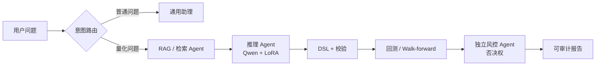

# AMD ROCm 本地量化智能体

**AMD AI DevMaster Hackathon 2026 — 赛道二：私有 AI Agent 本地部署**

这是一个运行在 AMD Radeon GPU / ROCm 上的本地投资与量化助理。它同时支持普通知识问答和可审计的量化工作流：用户问题经过意图路由后，可进入 RAG、多 Agent 推理、DSL 生成、校验、回测和风险报告链路。

## 当前能力

- ReAct 推理循环：思考、规划、工具调用、观察和最终回答。
- 多 Agent：检索 Agent → 推理 Agent → 独立风控 Agent；风控拥有否决权。
- 三层记忆：工作记忆、情景记忆、语义记忆。
- 多路 RAG：关键词、BM25、重排序和置信度门控。
- AMD 本地推理：Qwen2.5-7B、FP16 LoRA、ROCm vLLM。
- 结构化闭环：自然语言 → DSL → 规范化 → 校验 → 回测 → 风险报告。
- Dify 六节点编排：用户输入、RAG、LLM、代码校验、回测、风险报告。
- Open WebUI 对话入口：连接同一个 AMD 本地 vLLM 模型，支持自然对话和 Agent 调用。
- 普通问题走通用助理回复，不会被强制转换成策略 DSL。

## 已验证结果

| 项目 | 结果 |
|---|---:|
| GPU | gfx1100，ROCm 7.2.1 |
| LoRA | 400 条国内市场样本，39 步，615 秒 |
| 训练质量 | loss 0.2848，token accuracy 98.1% |
| 国内市场评估 | 修复后 24/24 |
| Dify 工作流 | 6 节点，3 个演示案例 |
| 测试 | 232 passed，另有 2 个已知异步测试问题 |

演示回测使用确定性合成历史数据，便于评委复现；不执行真实交易，也不构成投资建议。

## 一句话定位

**一个运行在 AMD Radeon / ROCm 本地环境的量化投资助理：把自然语言问题变成有证据、可执行、可回测、可审计，并且可以被风控否决的结果。**

## 为什么做

普通策略 Demo 往往只展示“模型生成了一段文字”。但投资助理真正需要的是完整闭环：问题要能理解，知识要有依据，策略要能执行，结果要能复现，风险要能拒绝。

```text
用户问题 → 证据检索 → 推理规划 → 可执行策略 → 回测度量 → 风控结论
```

普通问题走自然对话；量化问题进入受约束的 DSL、校验、回测和风控链路，不会被强制套成同一种策略模板。

## 核心价值证据

| 评委关心的问题 | 项目中的证据 |
|---|---|
| 能否理解普通问题 | 意图路由与通用助理回复 |
| 能否使用知识 | 多路 RAG、来源和置信度门控 |
| 能否真正执行任务 | DSL 校验、回测、Walk-forward、报告 |
| 能否控制风险 | 独立风控 Agent，拥有否决权 |
| 是否真正使用 AMD | ROCm 上的 LoRA 微调与 vLLM 推理 |



## 快速开始

```bash
bash scripts/setup.sh
python -m uvicorn src.api:app --host 0.0.0.0 --port 8080
python src/chat_app.py
```

### Open WebUI 配置

Open WebUI 是项目的主要对话入口，不调用 OpenAI 云端模型，而是连接 AMD GPU 主机上的本地 vLLM。

在 Open WebUI 中添加 OpenAI-compatible 连接：

```text
API Base URL: http://host.docker.internal:8000/v1
模型名称:     qwen-trader-merged
API Key:      任意非空占位字符串
```

如果 Open WebUI 不在 Docker 中运行，使用 `http://127.0.0.1:8000/v1`；如果运行在其他机器，使用 AMD 主机 IP。Dify 和 Open WebUI 使用同一个模型服务，确保演示结果一致。

```bash
bash scripts/verify_e2e.sh
python -m pytest tests/ -v
```

详细文档：

- [技术报告](./docs/technical_report.md)
- [最终状态](./docs/track2_final_status.md)
- [DSL 规范](./docs/dsl_specification.md)
- [Dify 编排指南](./dify/workflows/SETUP_GUIDE.md)
- [演示页面](./demos/dify_workflow_demo.html)

赛道三机器人内容已独立存放在私有仓库：[Radeon-hackathon-2026-07-track3](https://github.com/gxinxing/Radeon-hackathon-2026-07-track3)。
